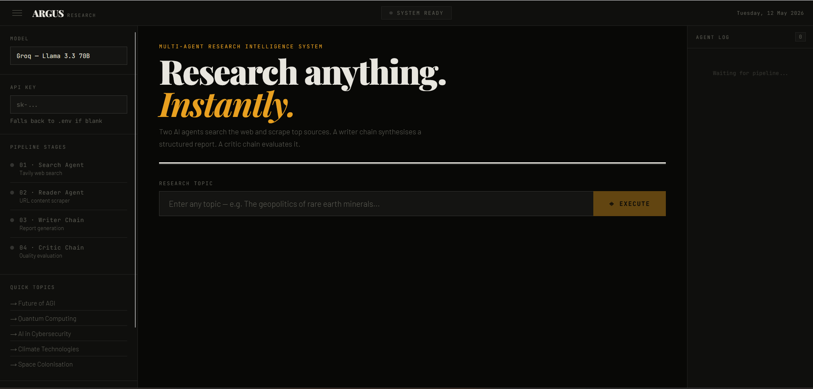
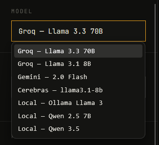
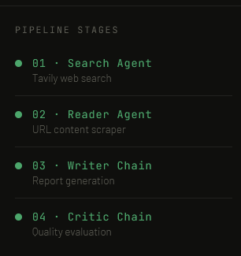
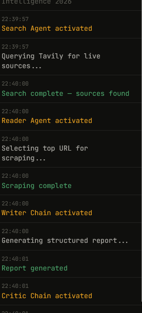
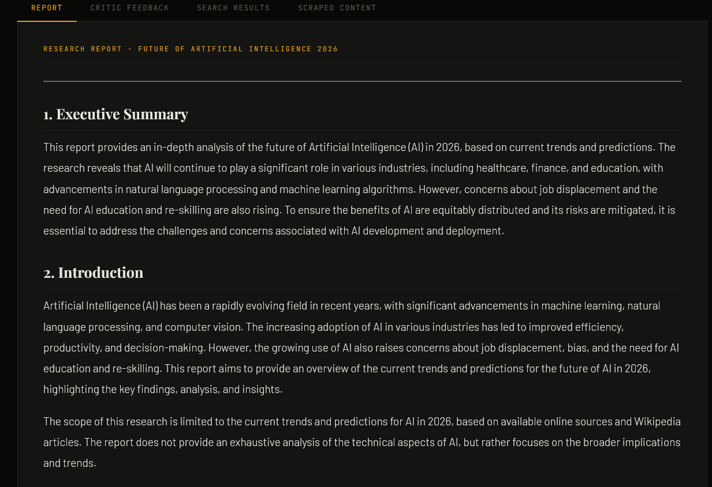
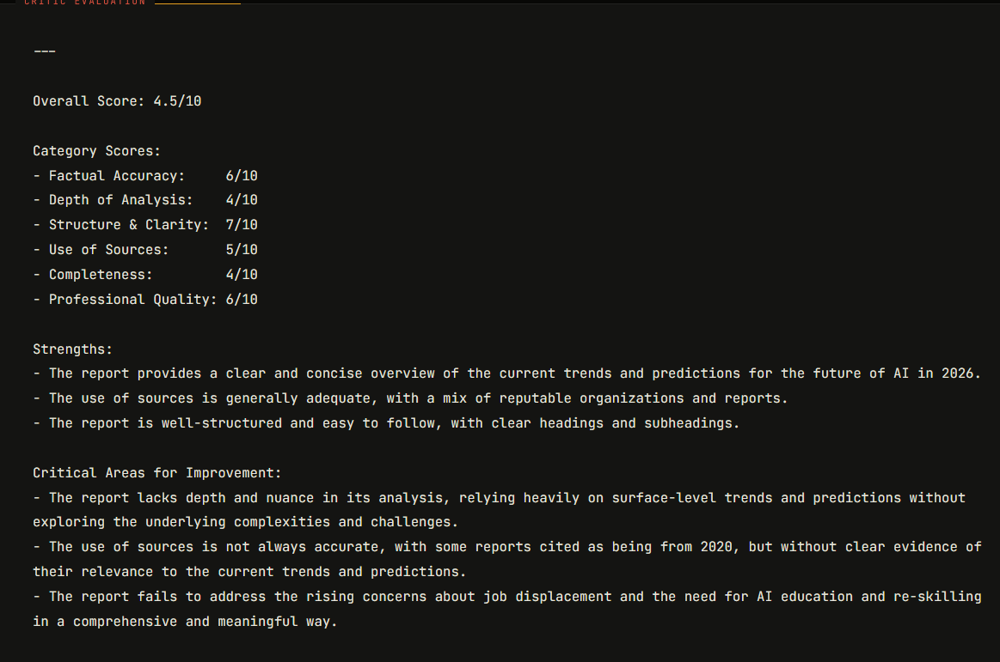

<div align="center">

# ◈ ARGUS
### Multi-Agent Research Intelligence System

> Give it any topic. 4 AI agents search, scrape, write, and critique — automatically.

[](https://argus-research-system.vercel.app)
[](https://github.com/SatyamKamboj10011/argus-research-system)
[](https://fastapi.tiangolo.com)
[](https://react.dev)
[](https://langchain.com)

</div>

---

## Screenshots

| Homepage | Model Selection |
|---|---|
|  |  |

| Pipeline Stages | Agent Log |
|---|---|
|  |  |

| Research Report | Critic Evaluation |
|---|---|
|  |  |

---

## What is ARGUS?

ARGUS is a fully deployed multi-agent AI research platform. Type any topic and it runs a complete 4-stage pipeline automatically — no human needed.

```
Search Agent → Reader Agent → Writer Chain → Critic Chain
```

| Stage | Tool | What it does |
|---|---|---|
| 🔍 Search Agent | Tavily API | Queries the web for live, real-time sources |
| 🕷️ Reader Agent | BeautifulSoup | Scrapes and extracts content from top URLs |
| ✍️ Writer Chain | LLM | Synthesises a structured professional report |
| 🧐 Critic Chain | LLM | Evaluates and scores the report for quality |

---

## Live Demo

🔗 **[argus-research-system.vercel.app](https://argus-research-system.vercel.app)**

- No signup required
- No API key needed — just open and use
- Works on desktop and mobile
- Switch between multiple free AI models

---

## Tech Stack

**Backend**
- Python 3.14
- FastAPI + Uvicorn
- LangChain LCEL Pipelines
- LangGraph ReAct Agents
- Tavily Search API
- BeautifulSoup4 + Requests

**Frontend**
- React.js
- Axios
- React Markdown
- Custom CSS — no UI framework

**LLM Providers — all free**
- Groq — Llama 3.3 70B / Llama 3.1 8B
- Cerebras — Llama 3.1 8B
- Google Gemini — 2.0 Flash
- Local — Ollama (any model)

**Deployment**
- Backend → Render
- Frontend → Vercel

---

## Features

- 🤖 Multi-agent ReAct pipeline with tool calling
- 🔄 5 LLM providers — switch between Groq, Cerebras, Gemini, or local Ollama
- 🔑 Bring your own API key or use the default
- 📊 Structured reports — Executive Summary, Key Findings, Analysis, Conclusion, Sources
- 🧐 Automatic quality scoring across 6 dimensions
- 📡 Real-time agent log feed showing every step
- 📥 Export full reports as .txt files
- 🌐 Fully deployed — zero setup required

---

## Project Structure

```
multi-agent-system/
├── agents.py          # LLM providers + agent/chain builders
├── tools.py           # Tavily search + BeautifulSoup scraper
├── pipeline.py        # 4-stage research pipeline
├── api.py             # FastAPI REST backend
├── requirements.txt   # Python dependencies
├── .env.example       # Environment variables template
├── screenshots/       # README screenshots
└── frontend/          # React frontend
    └── src/
        ├── App.js
        └── App.css
```

---

## Local Setup

### Prerequisites
- Python 3.10+
- Node.js 18+
- Git

### 1. Clone the repo

```bash
git clone https://github.com/SatyamKamboj10011/argus-research-system.git
cd argus-research-system
```

### 2. Create `.env` file

```env
GROQ_API_KEY=your_groq_api_key
TAVILY_API_KEY=your_tavily_api_key
CEREBRAS_API_KEY=your_cerebras_api_key     # optional
GOOGLE_API_KEY=your_google_api_key         # optional
```

**Get free API keys:**

| Provider | Link | Free Limit |
|---|---|---|
| Groq | [console.groq.com](https://console.groq.com) | 100k tokens/day |
| Tavily | [tavily.com](https://tavily.com) | 1000 searches/month |
| Cerebras | [cloud.cerebras.ai](https://cloud.cerebras.ai) | 1M tokens/day |
| Gemini | [aistudio.google.com](https://aistudio.google.com) | 1500 requests/day |

### 3. Install Python dependencies

```bash
pip install -r requirements.txt
```

### 4. Start the backend

```bash
uvicorn api:app --reload
```

Runs at `http://localhost:8000`

### 5. Start the frontend

```bash
cd frontend
npm install
npm start
```

Runs at `http://localhost:3000`

---

## API Reference

### GET /
Health check
```json
{"status": "online", "service": "ARGUS Research API"}
```

### POST /research

**Request:**
```json
{
  "topic": "Future of quantum computing",
  "model": "Groq — Llama 3.3 70B",
  "api_key": "optional"
}
```

**Response:**
```json
{
  "topic": "...",
  "search_results": "...",
  "scraped_content": "...",
  "report": "...",
  "feedback": "..."
}
```

---

## Deployment

### Backend — Render

1. Connect repo to [render.com](https://render.com)
2. Build command: `pip install -r requirements.txt`
3. Start command: `uvicorn api:app --host 0.0.0.0 --port $PORT`
4. Add environment variables in dashboard

### Frontend — Vercel

1. Update `API` in `frontend/src/App.js` to your Render URL
2. Run:
```bash
cd frontend
vercel --prod
```

---

## Using Local Models

1. Install [Ollama](https://ollama.ai)
2. Pull a model:
```bash
ollama pull llama3
ollama pull qwen2.5:7b
```
3. Run Ollama:
```bash
ollama serve
```
4. Select **Local** model in the UI sidebar

> ⚠️ Local models only work when running locally — not on the deployed version.

---

## Built In One Day

This entire project — agents, pipeline, FastAPI backend, React frontend, and deployment — was built in a single day as a learning exercise.

Still learning. Still building.

---

## License

MIT — free to use, modify, and distribute.

---

<div align="center">

**Made by [Satyam Kamboj](https://github.com/SatyamKamboj10011)**

⭐ Star this repo if you found it useful

[Live Demo](https://argus-research-system.vercel.app) · [Report Bug](https://github.com/SatyamKamboj10011/argus-research-system/issues) · [LinkedIn](https://www.linkedin.com/in/satyam-kamboj-742a79295/?skipRedirect=true)

</div>