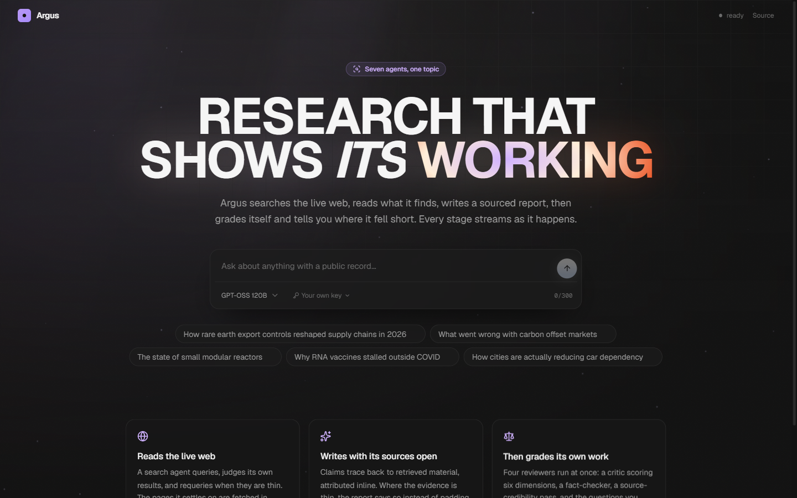
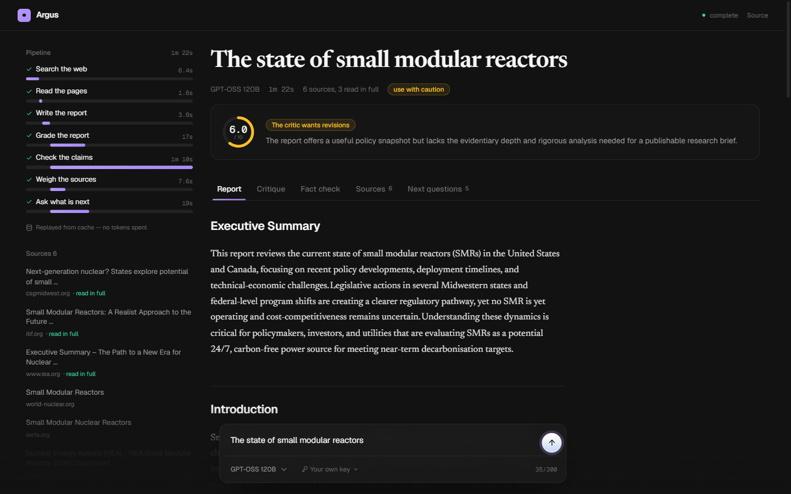
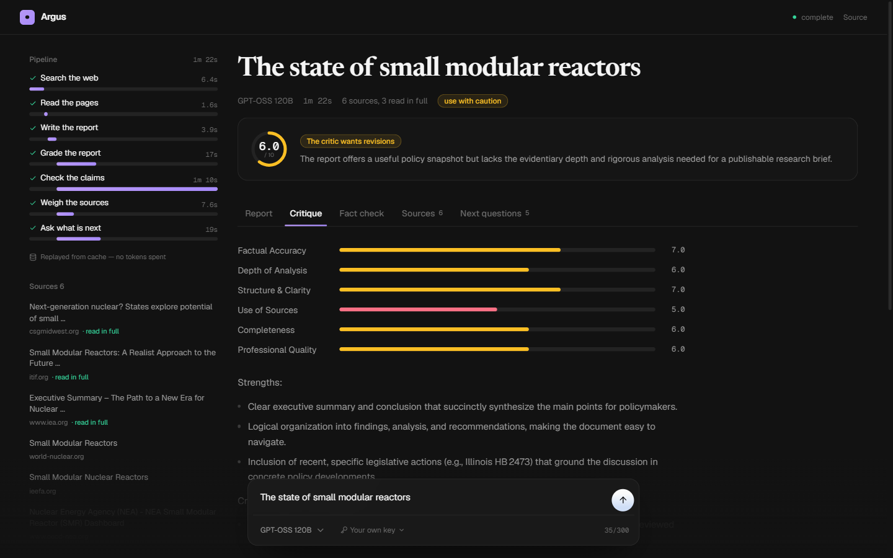
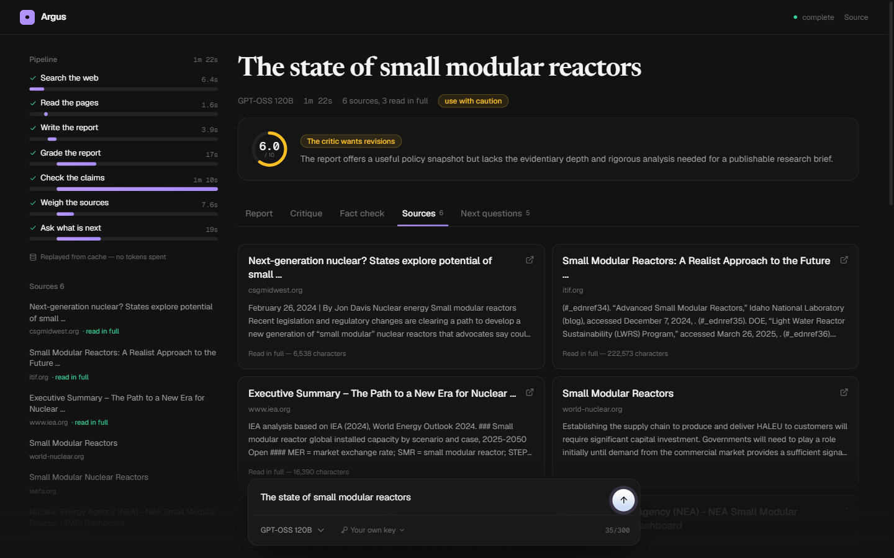
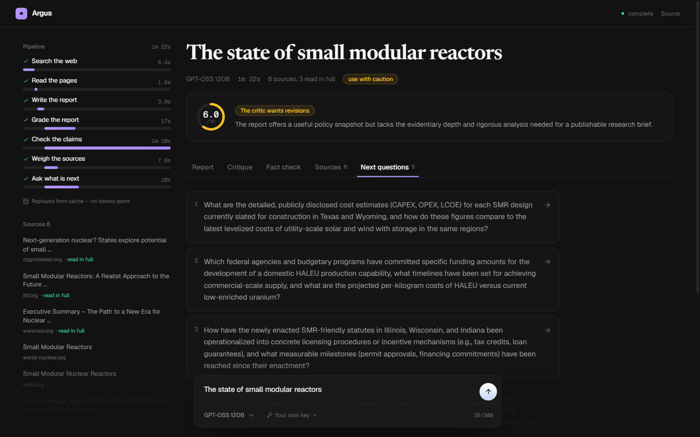
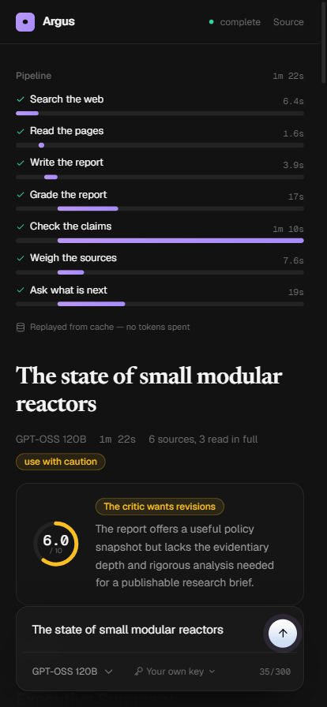

# Argus

**A multi-agent research pipeline that searches the live web, reads what it finds, writes a sourced report, then grades its own work.**

[](https://github.com/SatyamKamboj10011/argus-research-system/actions/workflows/ci.yml)
[](https://argus-research-system.vercel.app)
[](LICENSE)

Give it a topic. Seven stages run against real sources, and you watch each one happen — the progress you see is a live server-sent event stream, not a client-side animation.



---

## What it does

```
search ──► read ──► write ──┬──► critique     (six-dimension score)
                            ├──► fact-check   (claims vs. sources)
                            ├──► credibility  (authority of each source)
                            └──► follow-up    (what to research next)
```

The first three stages are sequential. The four review stages depend only on the
finished report, so they run concurrently — and because every bar on the timeline
is drawn from the server's own timings, you can see them overlap.

| Stage | What happens |
|---|---|
| **Search** | A ReAct agent queries Tavily, and re-queries if its own results are thin |
| **Read** | The top sources are fetched in parallel and stripped to readable text |
| **Write** | Sources become a structured report, streamed to the browser token by token |
| **Critique** | Scores the report 0–10 on accuracy, depth, clarity, sourcing, completeness and polish |
| **Fact-check** | Re-reads the report against the source material and flags unsupported claims |
| **Credibility** | Rates each source on authority, currency and bias |
| **Follow-up** | Turns the report's own gaps into the next five research questions |



The critic's overall score sits on the document as a ring, and its six category
scores are drawn as bars rather than buried in prose:



| Sources | Follow-up questions |
|---|---|
|  |  |

### Export

Every run exports as **PDF**, Markdown, JSON, or raw sources. The PDF is typeset
server-side rather than screenshotted, so the text stays selectable, links stay
clickable and the file stays a few hundred kilobytes — see
[a sample](screenshots/sample-report.pdf). The critic's score and the six category
bars are drawn into the document, and an appendix carries the critique, fact check
and source list.

---

## Quick start

```bash
git clone https://github.com/SatyamKamboj10011/argus-research-system.git
cd argus-research-system

cp .env.example .env        # then fill in TAVILY_API_KEY and GROQ_API_KEY
pip install -r requirements-dev.txt
uvicorn argus.api:app --reload
```

```bash
cd frontend
npm install
echo "VITE_API_URL=http://localhost:8000" > .env.local
npm run dev
```

Both free keys take about a minute to get:

| Service | Where | Free tier |
|---|---|---|
| Tavily (search) | [tavily.com](https://tavily.com) | 1,000 searches/month |
| Groq (inference) | [console.groq.com](https://console.groq.com) | rate-limited, no card |

### With Docker

```bash
docker build -t argus .
docker run -p 8000:8000 --env-file .env argus
```

---

## API

| Endpoint | Purpose |
|---|---|
| `POST /api/research/stream` | **Primary.** Runs the pipeline and streams server-sent events |
| `POST /api/research` | Blocking JSON, for scripts and non-streaming clients |
| `GET /api/models` | The model catalogue the frontend renders — never hard-coded client-side |
| `GET /api/stages` | Stage ids, labels and descriptions |
| `GET /` | Health, version, and which providers are actually configured |
| `POST /api/export/pdf` | Typesets a finished run as a PDF |
| `POST /research` | Deprecated alias of `/api/research`, kept for older clients |

Interactive docs are at `/docs` when the server is running.

```bash
curl -N -X POST http://localhost:8000/api/research/stream \
  -H 'Content-Type: application/json' \
  -d '{"topic":"The state of small modular reactors"}'
```

```
event: stage_completed
data: {"stage":"search","duration_ms":6703,"count":6,"sources":[...]}

event: token
data: {"stage":"write","text":"## Executive Summary"}

event: run_completed
data: {"result":{"report":"...","scores":{"overall":6.0,...},"timings_ms":{...}}}
```

Streaming uses `POST` rather than `EventSource` so an optional API key travels in
the request body and never lands in a URL, an access log, or browser history.

---

## Configuration

Everything is set through the environment; see [`.env.example`](.env.example) for the
annotated list. The settings worth knowing:

| Variable | Default | Why you would change it |
|---|---|---|
| `ALLOWED_ORIGINS` | `*` | **Set this in production.** `*` lets any site call your API using your keys |
| `REVIEW_CONCURRENCY` | `2` | How many review chains run at once. Free tiers meter tokens per minute and reject bursts |
| `MAX_RESEARCH_CHARS` | `14000` | Caps the payload handed to any single chain, so one request cannot exceed a tier's limit |
| `RATE_LIMIT_REQUESTS` | `10` per 10 min | Per-IP budget, so one visitor cannot drain your key |
| `CACHE_TTL_SECONDS` | `1800` | Repeat topics replay from cache instantly instead of re-running |
| `ALLOW_LOCAL_MODELS` | `false` | Enable when an Ollama instance is actually reachable |

### Models

The catalogue lives in [`argus/llm.py`](argus/llm.py) and is served over
`/api/models`, so the frontend can never drift from what the server supports.
Legacy model names still resolve to their replacements.

Provider model ids rot. This project previously shipped a registry pointing at
`llama-3.3-70b-versatile` long after Groq retired it, which meant every run died at
the writer stage with a 404. To catch that before a user does:

```bash
python scripts/check_models.py
```

It probes each registry entry, prints what is live, and exits non-zero if anything
points at a retired model.

---

## Development

```bash
pytest                              # 105 tests, no network, no API keys needed
ruff check argus tests && ruff format --check argus tests

cd frontend
npm run typecheck                   # tsc, strict
npm test                            # 43 tests: SSE parser, run reducer, formatters
npm run build
```

The backend suite runs entirely against a stub chat model and stubbed network
calls, so it is deterministic and costs nothing. PDF tests assert on document
structure and text encoding rather than pixels. CI runs the backend on Python
3.11 and 3.12, the frontend typecheck/tests/build, and a Docker image smoke test.

### Layout

```
argus/
  config.py     Validated settings; nothing else reads os.environ
  llm.py        Model registry and provider construction
  tools.py      Tavily search + an SSRF-guarded page reader
  prompts.py    Every chain prompt, reviewable as one diff
  pipeline.py   Async pipeline that yields events as work happens
  api.py        FastAPI app: SSE, rate limiting, caching
  pdf.py        Markdown -> typeset PDF, WinAnsi-safe
frontend/src/
  lib/sse.ts          SSE parser (pure, tested)
  lib/runState.ts     Event stream → render state (pure, tested)
  lib/format.ts       Durations, score tones, filename stems (tested)
  components/ui/      shadcn-style primitives + motion primitives
  components/         Hero, Composer, Workspace, ScoreGauge
  components/pipeline/Timeline.tsx
scripts/check_models.py
```

**Frontend stack.** Vite + React 19 + TypeScript, Tailwind CSS v4, Radix
primitives in the shadcn/ui idiom (`components.json` is present, so
`npx shadcn@latest add …` works), Motion for animation, Lucide for icons.

**Backgrounds.** `components/ui/backgrounds.tsx` holds the animated layers — a
canvas mesh gradient, CSS light beams, a parallax particle field, a perspective
grid and film grain. They are procedural rather than video: a few kilobytes
instead of a few megabytes, and every one halts under `prefers-reduced-motion`.
The canvases also stop drawing when the tab is hidden or they scroll off screen.

`api.py`, `agents.py`, `pipeline.py` and `tools.py` at the repository root are thin
shims re-exporting the package, so `uvicorn api:app` and any existing deployment
keep working unchanged.

---

## Notes on the free tier

Groq's free tier caps tokens per minute across your whole organisation. A full run
spends roughly 25k tokens, so it will be throttled. Argus handles this rather than
failing: review chains are gated to two at a time, payloads are capped, reasoning
models are asked for low reasoning effort, and a 429 is retried using the delay the
provider itself suggests. A run typically takes **60–90 seconds**; under heavy
throttling it can take longer, and the server gives up at `PIPELINE_TIMEOUT_SECONDS`
with an explanation rather than hanging.

---

## Deployment

**Backend (Render, Fly, any container host)**

- Build: `pip install -r requirements.txt`
- Start: `uvicorn argus.api:app --host 0.0.0.0 --port $PORT`
- Set `TAVILY_API_KEY`, `GROQ_API_KEY`, and `ALLOWED_ORIGINS` to your frontend URL

**Frontend (Vercel, Netlify, any static host)**

- Build: `npm run build` in `frontend/`
- Output directory: `build` (Vite's default `dist` is overridden in
  `vite.config.ts`, so an existing Vercel project needs no change)
- Set `VITE_API_URL` to your backend URL

> Migrated from Create React App to Vite. If your host pins `react-scripts` or a
> Node 16 runtime, bump it to Node 20.

---

## Design

A dark, motion-forward surface on neutral greys. The brand gradient — lavender
through cream to ember — is reserved for brand moments: the headline, the primary
action, the mark. It is never used for data, and the background layers are held
back behind a scrim so text keeps its contrast. Score and verdict colours are a
separate semantic set, so anything coloured in the document means a value.

The pipeline timeline is the one deliberately loud element. Its bars are drawn
from the server's own timings, so the overlap you see between the four review
stages is real concurrency, not decoration — which is the actual claim this
project makes.



---

## License

MIT — see [LICENSE](LICENSE).

Built by [Satyam Kamboj](https://github.com/SatyamKamboj10011).
